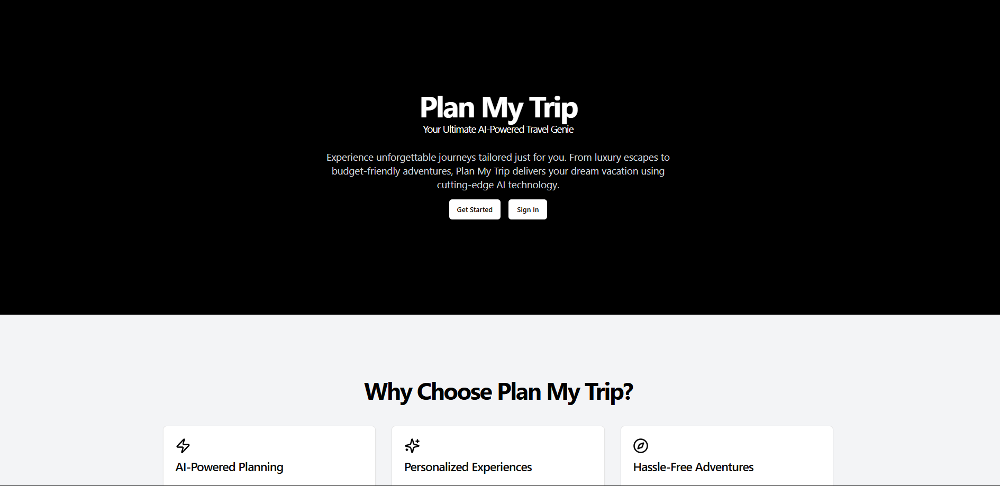
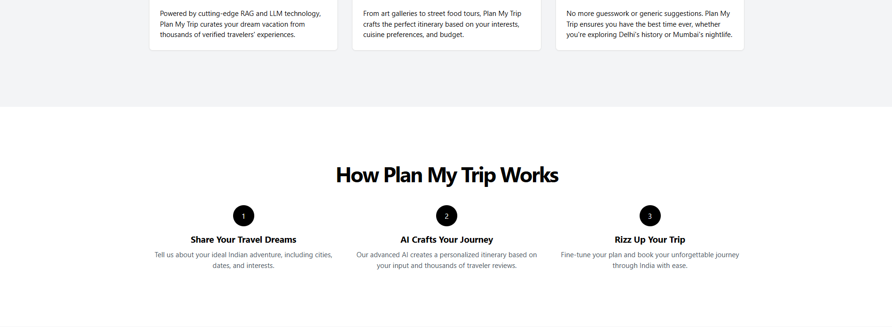
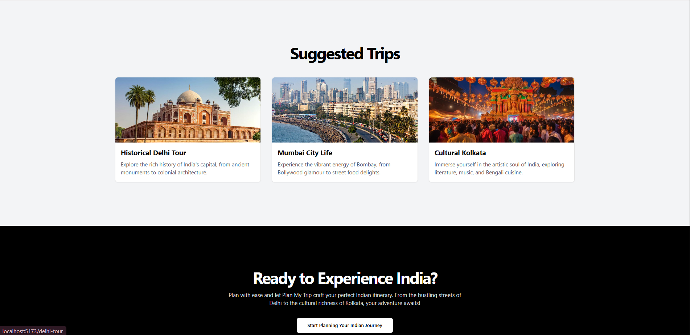
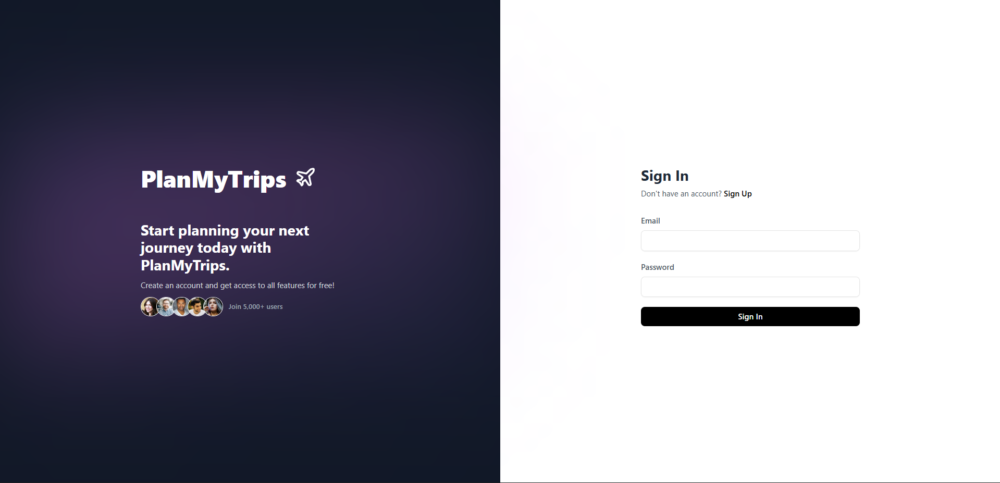
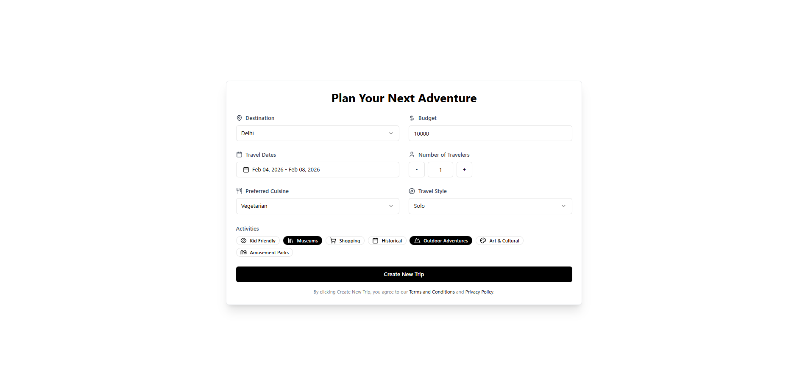
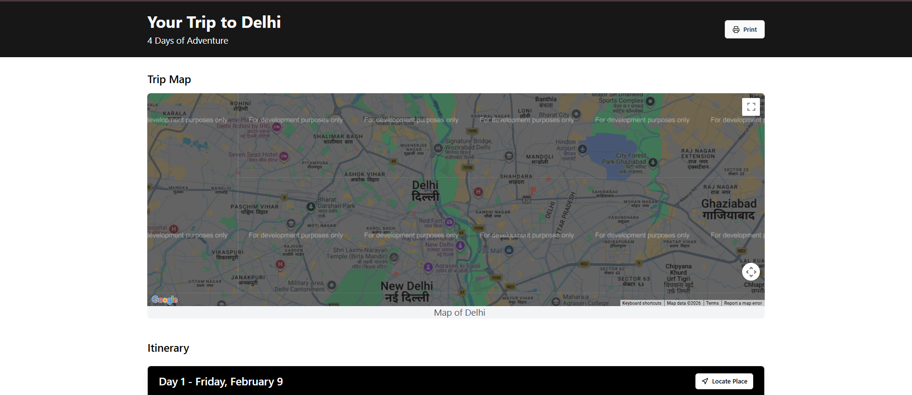
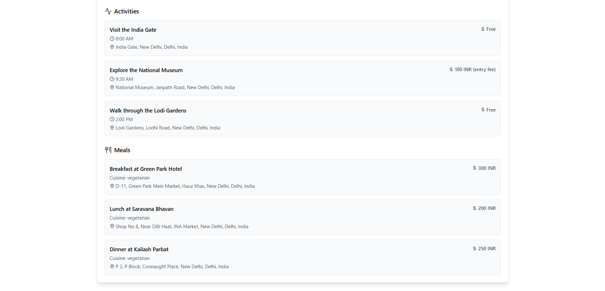
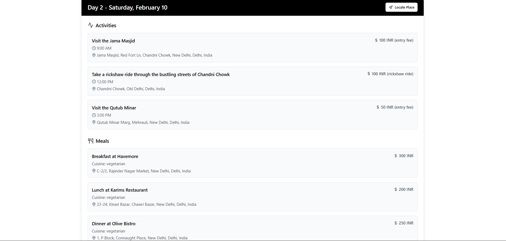
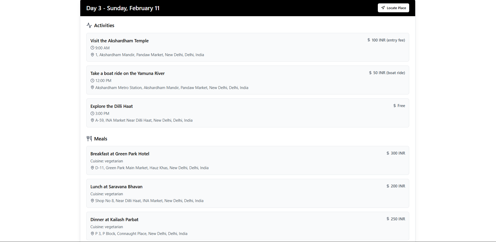
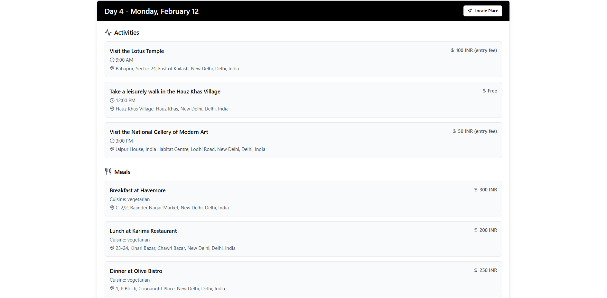

# ✈️ PlanMyTrips:

## AI-Powered Personalized Travel Itinerary Generator






<!--  -->


## 📚 Table of Contents

- [Introduction](#-introduction)
- [Features](#-features)
- [Tech Stack](#-tech-stack)
- [Architecture](#🏗-Architecture)
- [Setup and Installation](#-setup-and-installation)
- [Usage](#-usage)
- [AI and Data Processing](#-ai-and-data-processing)
- [Design Choices](#-design-choices)
- [Challenges and Solutions](#-challenges-and-solutions)
- [Future Improvements](#-future-improvements)
- [Deployment](#-deployment)
- [Personal Note](#-personal-note)

## 🌈 Introduction

PlanMyTrips is an innovative, **AI-powered travel itinerary generator** designed to create personalized travel experiences based on user preferences. Leve**RAG**ing cutting-edge AI technologies, including ****RAG** (Retrieval-Augmented Generation)** and **LLM (Large Language Models)**, PlanMyTrips curates dream vacations by synthesizing data from thousands of verified travelers' experiences.

This solution is focusing on creating a web application that generates tailored travel itineraries. AuraTrips goes beyond the basic requirements, offering a seamless, user-friendly interface coupled with powerful backend processing to deliver dynamic, detailed itineraries that cater to individual needs and preferences.

## ✨ Features

- 🖥️ User-friendly interface for inputting travel preferences
- 🤖 AI-powered itinerary generation using **RAG** and LLM technologies
- 💡 Personalized recommendations based on budget, interests, and trip duration
- 🗺️ Integration with Google Maps API for location visualization
- 📱 Responsive design for seamless use across devices
- 🔐 User authentication and itinerary saving functionality

## 🛠️ Tech Stack

### Backend


- **FastAPI**: High-performance, easy-to-use framework for building APIs
- **SQLAlchemy**: SQL toolkit and ORM for database operations
- **Pydantic**: Data validation and settings management
- **Groq API**: For accessing the LLaMA 3 language model
- **Python 3.9+**

### Frontend


- **React**: A JavaScript library for building user interfaces
- **Vite**: Next-generation frontend tooling
- **Tailwind CSS**: Utility-first CSS framework
- **shadcn/ui**: Re-usable components built with Radix UI and Tailwind
- **React Router**: Declarative routing for React applications
- **Axios**: Promise-based HTTP client for making API requests

### AI and Data Processing

- **LLaMA 3**: Open-source large language model for natural language processing
- **RAG (Retrieval-Augmented Generation)**: For enhancing AI responses with external data
- **CSV data ingestion**: For processing local datasets of travel destinations

## 🏗️ Architecture

AuraTrips follows a modern, scalable architecture:

1. **Frontend**: built with React, providing a responsive and interactive user interface.
2. **Backend API**: FastAPI-powered RESTful API handling user requests, authentication, and AI processing.
3. **Database**: SQLite for development, with easy file based makes it easy to deploy with backend.
4. **AI Processing**: Integration with Groq API for accessing the LLaMA 3 model, enhanced with **RAG** for personalized recommendations.
5. **External Services**: Google Maps API for location visualization and mapping features.

## 🚀 Setup and Installation

### Backend

1. Clone the repository:

   ```
   git clone https://github.com/anxkhn/auratrips.git
   cd auratrips/server
   ```

2. Set up a virtual environment:

   ```
   python -m venv venv
   source venv/bin/activate  # On Windows, use `venv\Scripts\activate`
   ```

3. Install dependencies:

   ```
   pip install -r requirements.txt
   ```

4. Set up environment variables:

   ```
   cp .env.example .env
   ```

   Edit the `.env` file with your specific configuration.

5. Run the server:
   ```
   uvicorn app.main:app --reload
   ```

### Frontend

login Page



Trips Planner Page


Travel Page







### Looks dope right? Time to set it up!

1. Navigate to the client directory:

   ```
   cd ../client
   ```

2. Install dependencies:

   ```
   npm install
   ```

3. Set up environment variables:

   ```
   cp .env.example .env
   ```

   Edit the `.env` file with your specific configuration.

4. Run the development server:
   ```
   npm run dev
   ```

## 📖 Usage

1. Open your browser and navigate to `http://localhost:5173` (or the port specified by Vite).
2. Sign up / sign in or continue without signing to your AuraTrips account.
3. Fill in your travel preferences, including destination, budget, interests, and trip duration.
4. Click "Generate Itinerary" to receive your personalized travel plan.
5. Explore and customize your itinerary as needed.

## 🧠 AI and Data Processing

AuraTrips implements a ****RAG** (Retrieval-Augmented Generation) model** to leverage data from a local CSV file containing information about the best travel destinations. This approach allows us to provide more accurate and up-to-date recommendations by combining the power of large language models with real-world data.

The **open-source LLaMA 3 model** is used for curating and generating personalized itineraries. By utilizing this advanced language model, we can create more natural and context-aware travel plans that truly reflect the user's preferences and interests.

The **RAG** implementation involves the following steps:

1. **Data Ingestion**: We process a CSV file containing verified travel destination data sourced from [Kaggle](https://www.kaggle.com/datasets/saketk511/travel-dataset-guide-to-indias-must-see-places). This dataset has information about 300+ destinations, and user ratings, providing a rich source of information for generating personalized itineraries.
2. **Retrieval**: When a user inputs their preferences, we use this data to retrieve relevant information about potential destinations and activities.
3. **Generation**: The LLaMA 3 model then uses this retrieved information, along with the user's preferences, to generate a tailored itinerary.

## 🎨 Design Choices

1. **FastAPI for Backend**: Chosen for its high performance, easy-to-use async capabilities, and built-in support for OpenAPI documentation.
2. **React with Vite for Frontend**: React provides a robust ecosystem for building interactive UIs, while Vite offers lightning-fast build times and hot module replacement.
3. **Tailwind CSS and shadcn/ui**: Allow for rapid UI development with a consistent design language.
4. ****RAG** Implementation**: Ensures AI-generated itineraries are grounded in real-world data and up-to-date information.
5. **LLaMA 3 via Groq API**: Offers more control over the AI's outputs and potential for future fine-tuning.
6. **CSV Data Integration**: Maintains a curated, high-quality dataset that can be easily updated and expanded.

## 🚧 Challenges and Solutions

1. **Challenge**: Integrating **RAG** with LLaMA 3 for accurate travel recommendations.
   **Solution**: Developed a custom pipeline that retrieves relevant information from our CSV dataset based on user preferences, then uses this context to guide the LLaMA 3 model in generating personalized itineraries.

2. **Challenge**: Unable to share with friends and family.
   **Solution**: Added a feature to share the itinerary by downloading it as a PDF file or printing it. Additionally, the unique link can be shared via email.

3. **Challenge**: Expensive to keep using LLaMA 3 model.
   **Solution**: Implemented caching of responses from the LLM to reduce the cost of using the model. Subsequent requests for the same itinerary are essentially free as they are hashed to get a unique id and stored in the database.

## 🔮 Future Improvements

1. Implement user feedback loops to continuously improve AI recommendations.
2. Integrate real-time pricing and availability data from travel APIs.
3. Develop a mobile app for on-the-go itinerary access and updates.
4. Enable sharing of entire itinerary PDF with friends and family via email.

## 🚀 Deployment

### Backend

The backend is deployed on Render and can be accessed at

[https://planmytrip-backend-t10k.onrender.com]().

### Frontend

The frontend is deployed on Vercel and can be accessed at

[plan-my-trip-ruby.vercel.app]().

Made with ❤️ by Nishant sharma
